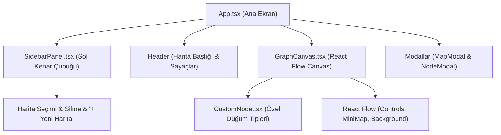

# 🎨 Frontend: React Flow Graf Canvas ve Paneller

> Bu doküman, **NetWork** projesinin React Flow tabanlı görselleştirme motorunu (`GraphCanvas`), özel düğüm tasarımlarını (`CustomNode`) ve harita yönetim panellerini (`SidebarPanel`, `MapModal`, `NodeModal`) tanımlar.
> 
> Üst Not: [[00 - Ana Harita]] | Mimari Kılavuz: [[Katmanli Mimari]] | Store Yönetimi: [[Zustand ve Servisler]]

---

## 🏗️ Bileşen Mimarisi ve Yerleşim

---

## 🧩 Bileşen Detayları

### 1. `App.tsx` (Ana Düzen)
- Tüm uygulamanın çatı bileşenidir.
- Sayfa yüklendiğinde `haritalariYukle()` fonksiyonunu tetikleyerek veritabanındaki haritaları çeker.
- Üst barda aktif haritanın adını, açıklamasını ve canlı düğüm/kenar sayaçlarını gösterir.
- Hata durumunda reaktif bildirim çubuğu gösterir.

### 2. `SidebarPanel.tsx` (Harita Yönetimi)
- Mevcut haritaları listeler.
- Aktif seçili haritayı vurgular; tıklandığında `haritaSec(id)` ile canvas içeriğini anında yeniler.
- Harita silme (`haritaSil(id)`) aksiyonunu onay penceresiyle yönetir.
- Yeni harita oluşturma modalını (`MapModal`) açar.

### 3. `GraphCanvas.tsx` (Graf Motoru)
- `reactflow` kütüphanesini ve `CustomNode` bileşenini kullanır.
- **Düğüm Formatlama:** `dugumler` listesini React Flow `Node[]` yapısına çevirir.
- **Kenar Formatlama:** `kenarlar` listesini ok başlıklı (`MarkerType.ArrowClosed`) ve animasyonlu kenarlara dönüştürür.
- **Kullanıcı Etkileşimleri:**
  - **Sürükle-Bırak:** `onNodeDragStop` ile düğümün yeni koordinatları sunucuya (`PATCH`) ve Zustand store'a anında kaydedilir.
  - **Bağlantı Çizme:** Düğümlerin kenar noktalarından (handle) sürüklenerek yeni bağ kurulduğunda `onConnect` tetiklenir ve sunucuya (`POST`) kenar eklenir.
  - **Kenar Silme:** Bağlantıya tıklandığında onay alınarak silinir.
- Boş harita durumlarında kullanıcıya rehberlik eden ipucu kartları barındırır.

### 4. `CustomNode.tsx` (Özel Düğüm Kartları)
Düğümler türlerine göre renk kodlamalı rozetler ve 4 yönlü bağlantı noktaları (Top, Bottom, Left, Right) ile render edilir:
- **👤 Kişi (`kisi`):** Mavi tema (`bg-blue-50`, `border-blue-400`)
- **🏢 Kurum (`kurum`):** Yeşil tema (`bg-emerald-50`, `border-emerald-400`)
- **💡 Kavram (`kavram`):** Sarı/Kehribar tema (`bg-amber-50`, `border-amber-400`)
- **📌 Diğer (`diger`):** Mor tema (`bg-purple-50`, `border-purple-400`)
- Her kart üzerinde hızlı silme (✕) butonu bulunur.

### 5. `MapModal.tsx` & `NodeModal.tsx`
Kullanıcıdan başlık, açıklama, etiket ve tür bilgisi alarak Zustand store üzerinden API servislerini çağıran modern arayüz modallarıdır.

### ⚠️ Bilinen Tuzak: Tip İçe Aktarımları
`tsconfig.app.json` içinde `verbatimModuleSyntax` açıktır. `reactflow` tipleri (`Node`, `Edge`, `Connection`, `NodeChange`, `NodeProps`) **mutlaka** `import { type Node }` biçiminde alınmalıdır. Aksi halde Vite tarayıcıda "does not provide an export named ..." hatası verir ve ekran tamamen beyaz kalır.

---
*İlgili Notlar:* [[00 - Ana Harita]] | [[Katmanli Mimari]] | [[Zustand ve Servisler]] | [[Gunluk]]
