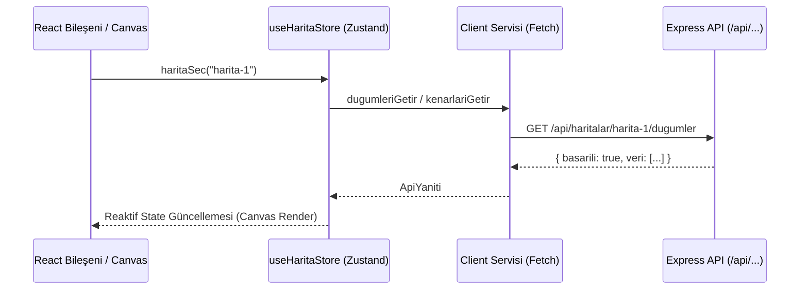

# ⚛️ Frontend: Zustand ve API Servisleri

> Bu doküman, **NetWork** istemci (`client/`) katmanındaki HTTP API istemcilerini, `useHaritaStore` Zustand global durum yönetimini ve asenkron veri senkronizasyonunu tanımlar.
> 
> Üst Not: [[00 - Ana Harita]] | Mimari Kılavuz: [[Katmanli Mimari]] | Backend API: [[Rotalar ve Controllers]]

---

## 🌐 API İstemcileri (`client/src/services/`)

Tüm servisler `VITE_API_URL` ortam değişkenini kullanır (varsayılan: `http://localhost:3000/api`). Her fonksiyon, `[[Rotalar ve Controllers|ApiYaniti<T>]]` tipinde sözleşmeli JSON yanıtı döner.

| Servis Dosyası | Metot | Bağlı Olduğu Uç Nokta | Açıklama |
| :--- | :--- | :--- | :--- |
| `haritaServisi.ts` | `haritalariGetir()` | `GET /haritalar` | Tüm haritaları getirir |
| `haritaServisi.ts` | `haritaGetir(id)` | `GET /haritalar/:id` | Tekil harita detayını getirir |
| `haritaServisi.ts` | `haritaOlustur(veri)` | `POST /haritalar` | Yeni harita oluşturur |
| `haritaServisi.ts` | `haritaGuncelle(id, veri)` | `PUT /haritalar/:id` | Harita başlık/açıklamasını günceller |
| `haritaServisi.ts` | `haritaSil(id)` | `DELETE /haritalar/:id` | Haritayı siler |
| `dugumServisi.ts` | `dugumleriGetir(haritaId)` | `GET /haritalar/:haritaId/dugumler` | Haritaya ait düğümleri getirir |
| `dugumServisi.ts` | `dugumOlustur(veri)` | `POST /haritalar/:haritaId/dugumler` | Haritaya yeni düğüm ekler |
| `dugumServisi.ts` | `dugumGuncelle(hId, dId, v)` | `PATCH /haritalar/:haritaId/dugumler/:id` | Düğüm konum/bilgi güncellemesi |
| `dugumServisi.ts` | `dugumSil(hId, dId)` | `DELETE /haritalar/:haritaId/dugumler/:id` | Düğümü siler |
| `kenarServisi.ts` | `kenarlariGetir(haritaId)` | `GET /haritalar/:haritaId/kenarlar` | Haritaya ait kenarları getirir |
| `kenarServisi.ts` | `kenarOlustur(veri)` | `POST /haritalar/:haritaId/kenarlar` | İki düğüm arası bağlantı kurar |
| `kenarServisi.ts` | `kenarSil(hId, kId)` | `DELETE /haritalar/:haritaId/kenarlar/:id` | Bağlantıyı siler |

---

## 🐻 Zustand Durum Yönetimi (`useHaritaStore`)

Dosya: `client/src/store/haritaStore.ts`

`useHaritaStore`, arayüzün ihtiyaç duyduğu reaktif verileri tutar ve doğrudan servis fonksiyonlarıyla senkronize çalışır.

### Durum Alanları (State)
- `secilenHaritaId: string | null` — Aktif haritanın CUID'si
- `haritalar: HaritaDTO[]` — Kullanıcının harita listesi
- `dugumler: DugumDTO[]` — Aktif haritadaki düğümler
- `kenarlar: KenarDTO[]` — Aktif haritadaki kenar bağlantıları
- `yukleniyor: boolean` — Ağ isteklerinin yüklenme göstergesi
- `hata: string | null` — Son oluşan hata mesajı (varsa)

### Asenkron Eylemler (Actions)
1. **Harita Akışı:**
   - `haritalariYukle()`: Sunucudaki haritaları çeker ve store'u doldurur.
   - `haritaSec(id)`: Aktif haritayı değiştirir ve paralel olarak `dugumleriYukle(id)` ve `kenarlariYukle(id)` çalıştırarak graf canvas'ı doldurur.
   - `haritaOlustur(veri)`: Yeni haritayı sunucuya yazar, store listesine ekler ve seçili harita yapar.
   - `haritaGuncelle(id, veri)`: Haritayı günceller.
   - `haritaSil(id)`: Haritayı siler; eğer silinen harita aktifse seçim durumunu sıfırlar.

2. **Düğüm & Kenar Akışı:**
   - `dugumEkle(veri)` / `dugumGuncelle(id, veri)` / `dugumSil(id)`
   - `kenarEkle(veri)` / `kenarSil(id)`
   - *Düğüm silindiğinde ona bağlı tüm kenarlar otomatik olarak store'dan da temizlenir.*

---

## 🔄 Katmanlı Akıştaki Yeri

### Ağ Hatası Dayanıklılığı
`client/src/services/istemci.ts` içindeki `istekGonder<T>()` tüm servislerin ortak HTTP çağrısıdır. Backend kapalıyken `fetch` hatası yakalanır ve `{ basarili: false, hata }` döner; böylece store `yukleniyor` durumunda takılı kalmaz, hata başlık altında gösterilir.

---
*İlgili Notlar:* [[00 - Ana Harita]] | [[Katmanli Mimari]] | [[Rotalar ve Controllers]] | [[Gunluk]]
