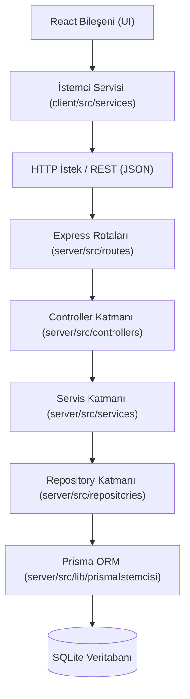

# 🏛️ Pragmatik Katmanlı Mimari

> Bu doküman, **NetWork** projesinin backend ve frontend organizasyonunu yöneten mimari kuralları ve SOLID prensipleri rehberini içerir.
> 
> Üst Not: [[00 - Ana Harita]]

---

## 🧭 Mimari Akış ve Kural Zinciri

NetWork mimarisinde katmanlar arası geçiş kesin ve tek yönlüdür. **Hiçbir katman bir sonrakini atlayamaz.**

---

## 🧱 Katmanların Görev Dağılımı

### 1. İstemci Katmanı (`client/`)
- **React Flow & UI:** Sadece görselleştirmeyi ve kullanıcı etkileşimini sağlar. İş mantığı barındırmaz.
- **Zustand Store (`store/`):** Ekran durumunu (seçili düğüm, yakınlaştırma, harita listesi) reaktif olarak tutar.
- **İstemci Servisleri (`services/`):** Backend REST API ile iletişim kurar (`fetch` / `axios` çağrıları). Tipleri `[[00 - Ana Harita|shared/types]]` üzerinden tüketir.

### 2. İletim ve Uç Nokta Katmanı (`routes/`)
- Gelen HTTP isteklerini karşılar, URL desenlerini çözer ve ilgili controller metoduna yönlendirir.
- Detaylar için bkz: [[Rotalar ve Controllers]].

### 3. Controller Katmanı (`controllers/`)
- **Sorumluluk:** HTTP isteğini (body, params, query) alır, temel girdi biçimini kontrol eder ve yanıtı döner (Status 200, 201, 400 vb.).
- **Yasak:** Kesinlikle iş kuralı içermez, doğrudan veritabanına erişmez.
- Detaylar için bkz: [[Rotalar ve Controllers]].

### 4. Servis Katmanı (`services/`)
- **Sorumluluk:** Tüm iş mantığının (business logic) ve domain kurallarının yaşadığı yerdir.
- Girdi verisinin mantıksal doğrulamalarını yapar (örn. "Düğümün ait olduğu harita mevcut mu?", "Kaynak ve hedef düğümler aynı haritada mı?").
- Hata durumunda anlamlı Türkçe hata fırlatır (`throw new Error("Kaynak düğüm bulunamadı")`).
- Veri erişimi için yalnızca Repository katmanını kullanır.

### 5. Repository Katmanı (`repositories/`)
- **Sorumluluk:** Veritabanı işlemlerini tamamen soyutlar (`findMany`, `create`, `update`, `delete`).
- İş kuralı bilmez, HTTP bağlamından habersizdir.
- Doğrudan `prismaIstemcisi` üzerinden sorgular çalıştırır.
- Detaylar için bkz: [[Prisma ve SQLite]].

---

## 💎 SOLID Prensipleri — Proje İçi Standartlar

| Prensip | NetWork Uygulaması |
| :--- | :--- |
| **S — Single Responsibility (Tek Sorumluluk)** | Her dosyanın ve her fonksiyonun tek bir görevi vardır. Controller sadece HTTP bilir, Servis sadece iş kuralı bilir, Repository sadece veritabanı bilir. |
| **O — Open/Closed (Açık/Kapalı)** | Mevcut kodu bozmadan genişletme esastır. Örneğin, yeni bir düğüm türü (stajyer, şirket, kavram) geldiğinde mevcut akış bozulmaz, yeni alt tipler ve stratejiler eklenir. |
| **L — Liskov Substitution (Yerine Geçebilme)** | Interface'leri uygulayan sınıflar birbirinin yerine şeffafça geçebilmelidir. |
| **I — Interface Segregation (Arayüz Ayrımı)** | Tek ve devasa interface'ler yerine; Düğüm, Harita ve Kenar için ayrıştırılmış odaklı tipler kullanılır (`[[00 - Ana Harita|shared/types]]`). |
| **D — Dependency Inversion (Bağımlılıkların Ters Çevrilmesi)** | Üst katmanlar alt katmanların somut detaylarına değil, soyut arayüz ve sözleşmelerine bağımlıdır. |

---

## 🔗 İlgili İkinci Beyin Notları
- [[00 - Ana Harita]]: Ana indeks ve vizyon
- [[Rotalar ve Controllers]]: Katmanın HTTP uç noktaları ve controller implementasyonu
- [[Prisma ve SQLite]]: Veri saklama ve repository mimarisi
- [[Gunluk]]: Servis ve repository katmanlarının tamamlanma seyri
