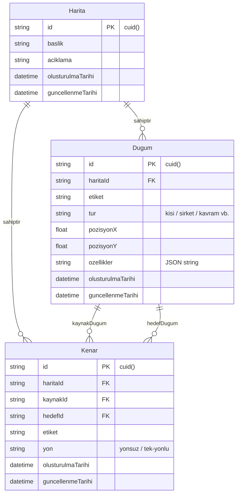

# 🗄️ Veritabanı: Prisma ve SQLite

> Bu doküman, **NetWork** projesinin veri saklama katmanını, Prisma ORM şemasını, veri modellerini ve repository entegrasyonunu açıklar.
> 
> Üst Not: [[00 - Ana Harita]] | Mimari Kılavuz: [[Katmanli Mimari]]

---

## ⚙️ Veritabanı Stratejisi

- **Geliştirme Ortamı (Development):** Sıfır konfigürasyon ve hızlı iterasyon için **SQLite** (`dev.db`).
- **Canlı Ortam Hedefi (Production):** Dağıtık yapı ve yüksek performans için **PostgreSQL**.
- **ORM Katmanı:** Prisma ORM v5+ (`prisma-client-js`).
- **İstemci Örneği:** `server/src/lib/prismaIstemcisi.ts` üzerinden tekil (singleton) `PrismaClient` örneği kullanılır.

---

## 📊 Veri Modelleri (Prisma Şeması)

Modeller, `server/prisma/schema.prisma` dosyasında şu şekilde tanımlanmıştır:



### 1. `Harita` Modeli (`haritalar` tablosu)
Bir ağı, zihin haritasını veya staj network grafiğini temsil eden ana kapsayıcı modeldir. Bir harita silindiğinde, bağlı tüm düğüm ve kenarlar cascade (`onDelete: Cascade`) yöntemiyle otomatik temizlenir.

### 2. `Dugum` Modeli (`dugumler` tablosu)
Graf üzerindeki düğümleri temsil eder.
- **Pozisyon (`pozisyonX`, `pozisyonY`):** React Flow koordinat düzlemine karşılık gelir.
- **Dinamik Nitelikler (`ozellikler`):** Sabit kolonlar yerine genişletilebilir JSON dizesi (`"{}"`) tutulur. Böylece staj network takibinde "şirket", "pozisyon", "LinkedIn URL" gibi dinamik alanlar şema değişikliği gerektirmeden saklanır.

### 3. `Kenar` Modeli (`kenarlar` tablosu)
Düğümler arasındaki ilişkileri kurar.
- `kaynakId` ve `hedefId` ilişkileri `Dugum` tablosuna cascade delete ile bağlıdır.
- `yon`: İlişkinin yönünü ifade eder (varsayılan: `"yonsuz"`).

---

## 🗃️ Repository Katmanı ile Entegrasyon

Prisma sorguları controller veya servis katmanlarında doğrudan **kullanılmaz**. Yalnızca `[[Katmanli Mimari]]` gereğince repository katmanında çalıştırılır:

| Repository Dosyası | Temel Metotlar | Açıklama |
| :--- | :--- | :--- |
| `haritaRepository.ts` | `tumunuGetir`, `idIleGetir`, `olustur`, `guncelle`, `sil` | Harita CRUD işlemleri |
| `dugumRepository.ts` | `haritayaGoreGetir`, `idIleGetir`, `olustur`, `guncelle`, `sil` | Haritaya ait düğümlerin yönetimi |
| `kenarRepository.ts` | `haritayaGoreGetir`, `idIleGetir`, `olustur`, `sil` | İki düğüm arasındaki bağların yönetimi |

---

## 📜 Veritabanı Kuralları

1. **CUID:** Tüm birincil anahtarlar tahmin edilemez ve çakışmasız `cuid()` ile oluşturulur.
2. **UTC Zaman Damgaları:** `olusturulma_tarihi` ve `guncellenme_tarihi` her zaman UTC standardında saklanır.
3. **Migrasyon Disiplini:** Şema değişikliklerinde el ile SQL yazılmaz; daima `npx prisma migrate dev` komutu çalıştırılır.

---

## 🛠️ Yararlı Prisma Komutları

```bash
# Şema değişikliklerini geliştirme veritabanına uygula
cd server && npx prisma migrate dev --name <degisiklik_adi>

# Prisma Client tiplerini yeniden üret
cd server && npx prisma generate

# Veritabanı içeriğini tarayıcıda görsel olarak incele
cd server && npx prisma studio
```

---
*İlgili Notlar:* [[00 - Ana Harita]] | [[Katmanli Mimari]] | [[Rotalar ve Controllers]] | [[Gunluk]]
